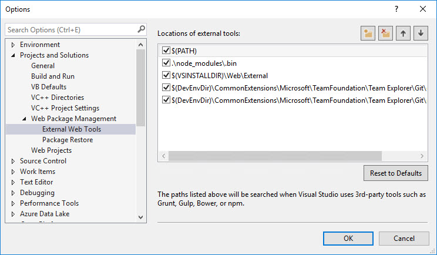

# Lab: Smart UI with Microsoft Graph

In this lab, you will walk through building a web user interface with Office UI Fabric components and invoking Office 365 pickers for interacting with data from the Microsoft Graph.

## In this lab

1. Using Office 365 Pickers
1. Using Office UI Fabric Cards
1. Render an Adaptive Card with data from Microsoft Graph

## Prerequisites

This lab will require an Office 365 tenant and a user account with the ability to grant administrative consent in the tenant.

### Install developer tools

The developer workstation requires the following tools for this lab.

#### NodeJS

Install [NodeJS](https://nodejs.org/en/) Long Term Support (LTS) version.

- If you have NodeJS already installed please check you have the latest version using node -v. It should return the current [LTS version](https://nodejs.org/en/download/).

After installing node, make sure npm is up to date by running following command:

````shell
npm install -g npm
````

Configure Visual Studio to use the NodeJS version you installed instead of the version included in the Visual Studio install:

1. Click **Tools > Options**.
1. Expand **Projects and Solutions > Web Package Management**.
1. Click on **External Web Tools**.
1. Select the entry **$(PATH)**.
1. Click the up arrow to make this entry first in the list.



#### NPM Task Runner for Visual Studio

Install [NPM task runner](https://marketplace.visualstudio.com/items?itemName=MadsKristensen.NPMTaskRunner)

#### Azure Active Directory (Azure AD) Tenant Id

The application created in this lab requires the id of the tenant in which the application is registered. Use the support article [Find your Office 365 tenant ID](https://support.office.com/en-us/article/find-your-office-365-tenant-id-6891b561-a52d-4ade-9f39-b492285e2c9b) to obtain the id.

## Exercise 1. Using Office 365 Pickers

In this exercise, you will extend an ASP.NET Core application to use pickers provided by Office 365 services.

### Register an application in AAD

To enable an application to call the Microsoft Graph, an application registration is required. This lab uses the [Azure Active Directory v2.0 endpoint](https://docs.microsoft.com/en-us/azure/active-directory/develop/active-directory-v2-compare).

1. Open a browser to the url **https://apps.dev.microsoft.com**
1. Log in with a Work or School account.
1. Click **Add an app**
1. Complete the **Register your application** section, entering an Application name. Clear the checkbox for Guided Setup. Click **Create**

    

1. On the registration page, in the **Application Secrets** section, click **Generate New Password**. Copy the generated password for future use.

    

1. On the registration page, in the **Platforms** section, click **Add Platform**.
1. In the **Add Platform** dialog, click **Web**.
1. Enter a **Redirect URL** to the callback page file. For this lab, use the value `https://localhost:44313/OneDriveFilePickerCallback.html`

1. Click the **Add URL** button.
1. Enter a **Redirect URL** for the implicit flow callback. For this lab, use the value `https://localhost:44313/signin-oidc'
1. Click the **Add URL** button again.
1. Enter a **Redirect URL** for the admin consent callback. For this lab, use the value `https://localhost:44313/Account/AADTenantConnected'

    

1. Click **Save**.
1. Make note of the Application Id. This value is used in the authentication / token code.
1. Scroll down to the **Microsoft Graph Permissions** section.
1. Next to **Delegated Permissions**, click the **Add** button.
1. In the **Select Permission** dialog, scroll down and select the following Scopes:
    1. **email**
    1. **Group.Read.All**
    1. **offline_access**
    1. **openid**
    1. **profile**
1. Click **OK**.

    

    1. Click **Save**.

### Update application configuration

1. Open the starter application. The started application is a Visual Studio solution that can be found at `LabFiles\StarterProject\GraphUI.sln`.
1. Open the `appSettings.json` file.
1. Update the following properties, specifying the values from the app registration process.

  ```json
    "Domain": "[yourdomain.onmicrosoft.com]",
    "TenantId": "[your-tenant-id]",
    "ClientId": "[your-client-id]",
    "ClientSecret": "[your-client-secret]",
  ```

### Provide administrative consent to application

1. Press F5 to run the application.
1. When prompted, log in with your Work or School account and grant consent to the application.
1. The application will load the **Permission Required** page. Reading Groups from the tenant requires administrative consent, and must be performed via a specific endpoint. Click the **Connect your tenant** link.
1. Log in with an account that has administrative privileges in the tenant.
1. On the administrative consent dialog, click **Accept**.
1. The app will then display the Home page.
1. Stop debugging

### Add the OneDrive File Picker
OneDrive provides File pickers for Android and JavaScript. This lab uses the JavaScript version. Additional information is available on the [reference page](https://docs.microsoft.com/en-us/onedrive/developer/controls/file-pickers/js-v72/).

The File picker requires a control for the user to invoke the picker, and a callback page to receive the requested information from OneDrive. Create the callback page by performing these steps:

1. In Solution Explorer, right-click on the **wwwroot** folder and choose **Add > New Item...**
1. Select the **HTML Page** template. Name file `OneDriveFilePickerCallback.html`

    

1. Replace the contents of the file the following statements:

  ```html
  <!DOCTYPE html>
  <html lang="en">
    <script type="text/javascript"  src="https://js.live.net/v7.2/OneDrive.js"></script>
  </html>
  ```

1. Save and close the file.
1. Open the file `Views\Picker\Index.cshtml`
1. Notice that line 12 contains a button with a JavaScript handler for the click event.
1. At the bottom of the page, at line 29, is a Razor section named **scripts**. Add the following tag inside the **scripts** section to load the File picker control.

  ```javascript
  <script type="text/javascript" src="https://js.live.net/v7.2/OneDrive.js"></script>
  ```

1. Add the following code after the `OneDrive.js` script tag. (The code is available in the `LabFiles\Pickers\OneDriveFilePicker.js` file):

> **NOTE:** In the script, there is a token called [your-client-id]. Replace this token with the client id of the application registered during the setup of this lab. This is the same id as used in the `appSettings.json` file.

  ```javascript
  <script type="text/javascript">
    function launchOneDrivePicker() {
      var ClientID = "[your-client-id]";

      var odOptions = {
        clientId: ClientID,
        action: "query",
        multiSelect: false,
        advanced: {
          queryParameters: "select=id,name,size,file,folder,photo,@@microsoft.graph.downloadUrl",
          redirectUri: 'https://localhost:44313/OneDriveFilePickerCallback.html'
        },
        success: function (files) {
          var data = files;
          var fileName = data.value[0]["name"];
          var filePath = data.value[0]["@@microsoft.graph.downloadUrl"];

          document.getElementById('selectedFileName').innerHTML = '<strong>' + fileName + '</strong>';
          document.getElementById('selectedFileUrl').innerText = filePath.substr(0, filePath.indexOf('tempauth') + 15) + '...';
        },
        cancel: function () {
          /* cancel handler */
        },
        error: function (e) {
          /* error handler */
          alert(e);
        }
      };
      OneDrive.open(odOptions);
    }
  </script>
  ```

1. Run the application.
1. Click on the **Pickers** link in the left-side navigation.
1. Click the **Select from OneDrive** button.
1. The File picker has a set of permissions that it requires. The app registration performed in this lab does not include those permissions, so you will need to log in and grant consent to your OneDrive for Business library.
1. After consenting, the File picker renders in dialog window.

    

1. Select a file and click **Open**.
1. The File picker will close the dialog and call the `success` callback, passing the requested information.


## Exercise 2

Add persona  banner.tsx